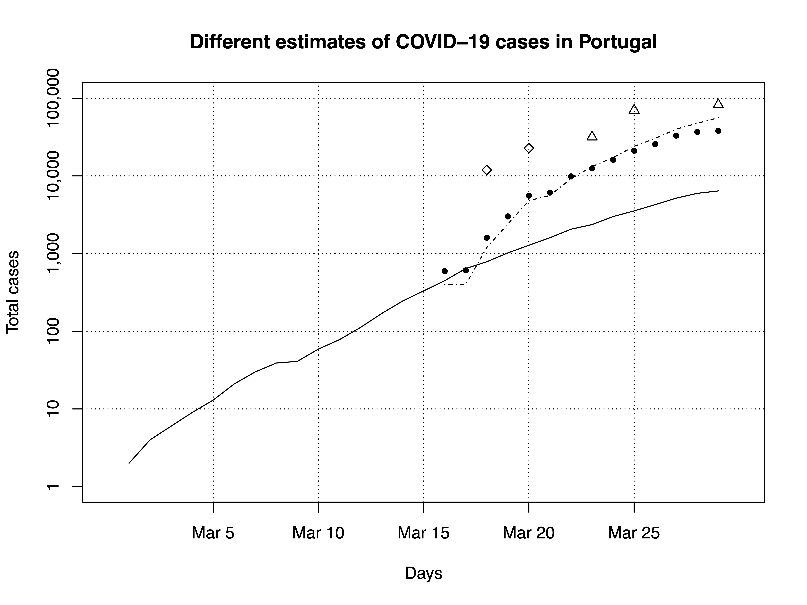
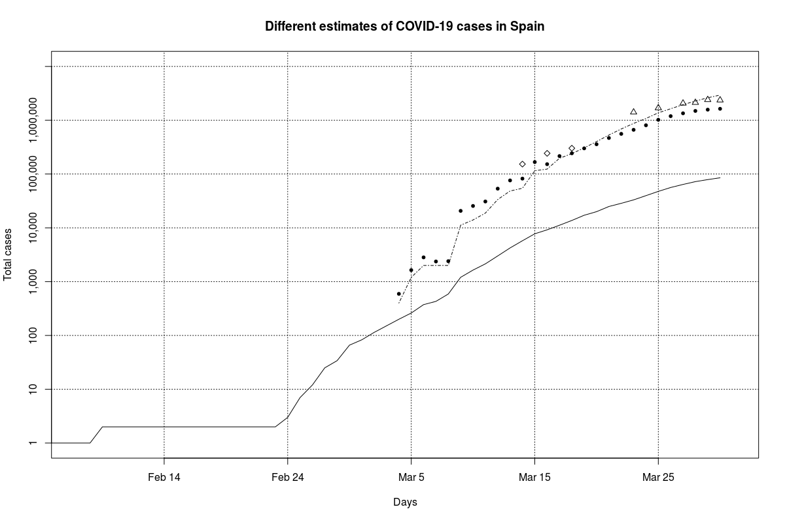

# @CoronaSurveys: Monitoring COVID-19 incidence via open polls

## [**Click here for links to all our country surveys**](surveys.md)

## Motivation

The world is suffering from a pandemic called COVID-19, caused by the SARS-CoV-2 virus. National governments can face challenges in evaluating the reach of the epidemic, since they have limited resources and tests at their disposal. Hence, any means to evaluate the number of persons with symptoms compatible with COVID-19 with reasonable level of accuracy is useful.

## Objective

The objective of this study is the collection and publication of data about the number of people showing symptoms compatible with COVID-19 in different countries. Our hope is that this data will be useful to estimate the number of infected persons with the COVID-19 virus at a given point in time in a given country, and then track the evolution of this number over time.

## How you can help

Please complete one of our surveys!! Choose your country of residence and tell us about the number of cases (suspected or confirmed) you know about. No personal information is stored in these surveys. Because each of us can provide information about the situation among our direct contacts, in aggregate we are able to get rough estimates of total cases.

Because we are tracking the evolution of this epidemic over time, once you have completed the survey, please remember to come back and update the survey every day. And finally, you can help us by asking your friends, colleagues and relatives to complete the survey as well! Thank you!

You can find our results and links to our surveys in [http://coronasurveys.org](http://coronasurveys.org)

## Latest Reports

**First report with the estimates of COVID-19 cases in Spain and Portugal**

[Measuring Icebergs: Using Different Methods to Estimate the Number of COVID-19 Cases in Portugal and Spain](reports/2020-03-29-CaseEstimation.pdf)

Latest case estimates for Portugal and Spain. Solid line is official confirmed cases. Dashed lines and solid dots are the number of cases as estimated from deaths (times 400) and from corrected case fatality ratios, respectively. Diamonds and triangles show the results from @CoronaSurveys, Twitter and Google Forms, respectively.

## Methodology

The study will periodically issue open surveys in different countries to which any person can answer. In these surveys we will ask every participant to report how many people he/she knows that have shown symptoms compatible with a COVID-19 infection. We will additionally ask for other indirect data, like the number of people he/she knows. We will not ask for any private information of any participant in the poll. The data is collected anonymously and cannot be backtraced to the participant in the poll.

The data collected will be cleaned and processed in order to provide estimates of the number of persons with symptoms compatible with COVID-19 in the different countries, and its evolution over time. While these estimates are not expected to be fully accurate, they will hopefully be in the same order of magnitude as the real value. The estimates will be contrasted with other estimates and any data available, to validate its accuracy

### Other Methods to Estimate the Number of Cases

- Hiroshi Nishiura et al. Early Epidemiological Assessment of the Virulence of Emerging Infectious Diseases: A Case Study of an Influenza Pandemic. Plos One. August 31, 2009. https://journals.plos.org/plosone/article?id=10.1371/journal.pone.0006852

- James Gorman. The Coronavirus, by the Numbers. The New York Times, March 5th, 2020. https://www.nytimes.com/2020/03/05/health/coronavirus-deaths-rates.html

- Ryosuke Omori, Kenji Mizumoto, Hiroshi Nishiura.
Ascertainment rate of novel coronavirus disease (COVID-19) in Japan.
medRXid, March 10th, 2020.
https://www.medrxiv.org/content/10.1101/2020.03.09.20033183v1

- Amy Maxmen. How much is coronavirus spreading under the radar? Nature News Explainer, March 13th, 2020. https://www.nature.com/articles/d41586-020-00760-8

- Alberto Fernández.
Coronavirus en España (I): Razones para Actuar con Urgencia y Contundencia.
Medium, Marc h 15th, 2020.
https://medium.com/@albertofffernandez/coronavirus-en-espa%C3%B1a-i-razones-para-actuar-con-urgencia-y-contundencia-bba8eafa12f

- Timothy W Russell et al. Using a delay-adjusted case fatality ratio to estimate under-reporting. CMMID Repository, March 22nd, 2020. https://cmmid.github.io/topics/covid19/severity/global_cfr_estimates.html

- Antonio J. Durán. ¿Cómo estimar el número de infectados reales por covid-19? Los casos de Andalucía e Italia. Blog IMUS, March 23rd, 2020. http://institucional.us.es/blogimus/2020/03/como-estimar-el-numero-de-infectados-reales-por-covid-19-el-caso-de-andalucia-e-italia/

- Kiko Llaneras. Los números del coronavirus: ¿Cuántos infectados hay realmente en España? El País, March 28th, 2020. https://elpais.com/politica/2020/03/24/actualidad/1585077503_994849.html

- Flaxman et al. Estimating the number of infections and the impact of nonpharmaceutical interventions on COVID-19 in 11 European countries. March 30th, 2020.
https://www.imperial.ac.uk/media/imperial-college/medicine/sph/ide/gida-fellowships/Imperial-College-COVID19-Europe-estimates-and-NPI-impact-30-03-2020.pdf

## Research Team

The study is conducted by a team led by the Research Professor Antonio Fernández Anta, and formed by a set of international researchers from multiple institutions:

Carlos Baquero,
U. Minho & INESC TEC,
Portugal

Annette Bieniusa,
U. Kaiserslautern,
Germany

Paolo Casari,
University of Trento,
Italy

Ignacio Castro,
QMUL,
UK

Davide Frey,
Inria Rennes,
France

Augusto Garcia-Agundez,
TU Darmstadt,
Germany

Angeliki Gazi,
Panteion University of Social and Political Sciences,
Greece

Chryssis Georgiou,
U. Cyprus,
Cyprus

Benjamin Girault,
USC,
USA

Raquel Menezes,
U. Minho,
Portugal

Esteban Moro,
UC3M & MIT,
Spain & USA

Nicolas Nicolaou,
Algolysis Ltd,
Cyprus

Oluwasegun Ojo,
IMDEA Networks & UC3M,
Spain

Antonio Ortega,
USC,
USA

Paul Patras,
U. Edinburgh,
UK

Efstathios Stavrakis,
Algolysis Ltd,
Cyprus

Yuichi Tanaka,
Tokyo University of Agriculture and Technology,
Japan

Christopher Thraves,
U. Concepción,
Chile

Pelayo Vallina,
IMDEA Networks & UC3M,
Spain

Lin Wang,
Vrije Universiteit Amsterdam,
Netherlands

## Collaborators

Natalie Soto

Rodrigo Irarrazaval

## Data Availability and License

We will make all the data available here. The data of the first collection of surveys will be available shortly.

In the meantime, you access some aggregated results at https://docs.google.com/spreadsheets/d/1dn8o8xSuBQTQYzMhKvqoxzWe4FXGbY1MpehyUM4gnwk/edit#gid=1914437865

All the data in this project is distributed under the Open Data Commons Attribution License.

## See Also

In the news:

- madri+d (April 2nd, 2020): https://www.madrimasd.org/notiweb/noticias/un-investigador-imdea-networks-cifra-en-mas-dos-millones-los-casos-sintomaticos-actuales-covid-19-en-espana#utm_source=notiweb_newsletter&utm_medium=email&utm_campaign=noti1_02apr20

- EFE (April 1st, 2020): https://www.efe.com/efe/espana/destacada/un-estudio-cifra-en-mas-de-2-millones-los-casos-covid-19-espana/10011-4210630

- EFE (April 1st, 2020): https://www.efe.com/efe/espana/efefuturo/un-estudio-cifra-en-mas-de-2-millones-los-casos-covid-19-espana/50000905-4210665?fbclid=IwAR1OHlWSJbjdM7LPDmAYMbMllTxDhrQr_hid_yR5d9Z1zZalCvjyWjti4fw

- El Pais (March 25th, 2020): https://elpais.com/politica/2020/03/24/actualidad/1585077503_994849.html

## Contact

Twitter: https://twitter.com/coronasurveys

Facebook: https://www.facebook.com/groups/209076966867175/

Instagram: https://www.instagram.com/coronasurveys/

E-mail: coronasurveys@gmail.com
